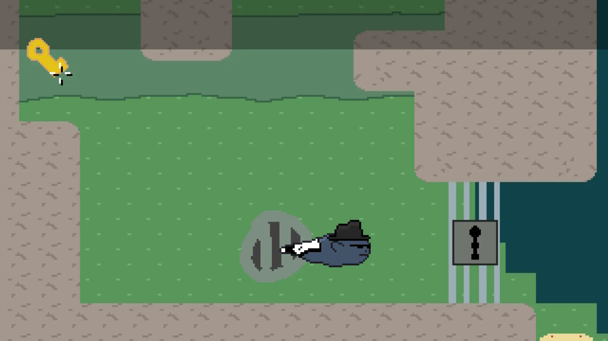
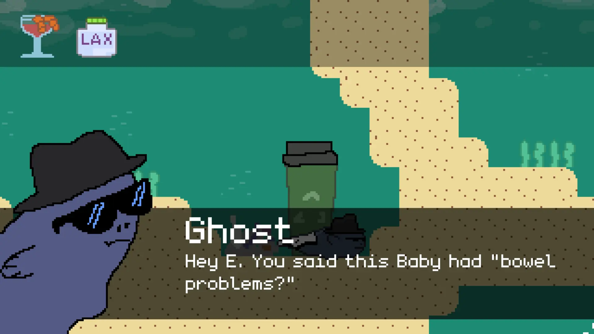
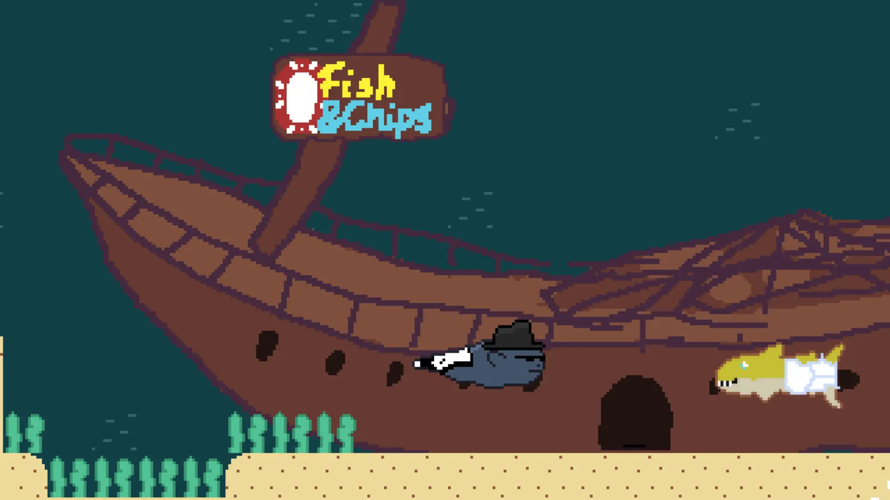

# Shell Company

A short, narrative-driven 2D adventure game about a fish detective.
Originally conceived in 7 days as an entry for [HaxeJam 2024: Winter Jam](https://itch.io/jam/haxejam-2024-winter-jam).
Written in [Haxe](https://haxe.org/), built with [Ceramic](https://ceramic-engine.com/).

> [!IMPORTANT]
>
> * The repository you're seeing right now presents this project in a slightly different state than it was in on Dec 29, 2024, during the HaxeJam 2024.
> * To see the source of the game as it has been submitted, [click here](https://github.com/Frixuu/ShellCompany/tree/jam-submission).

## Screenshots

## Licenses

All Haxe game code written for this game is [MIT-licensed](./LICENSE.md).
Those files should have a `SPDX-License-Identifier: MIT` at the top.

First-party assets (mostly sprites and levels) are CC-BY-4.0-licensed.  
Some third-party assets (fonts, music, sound effects) have been used. [Click here for the full list & license info.](./assets/LICENSE.md)
